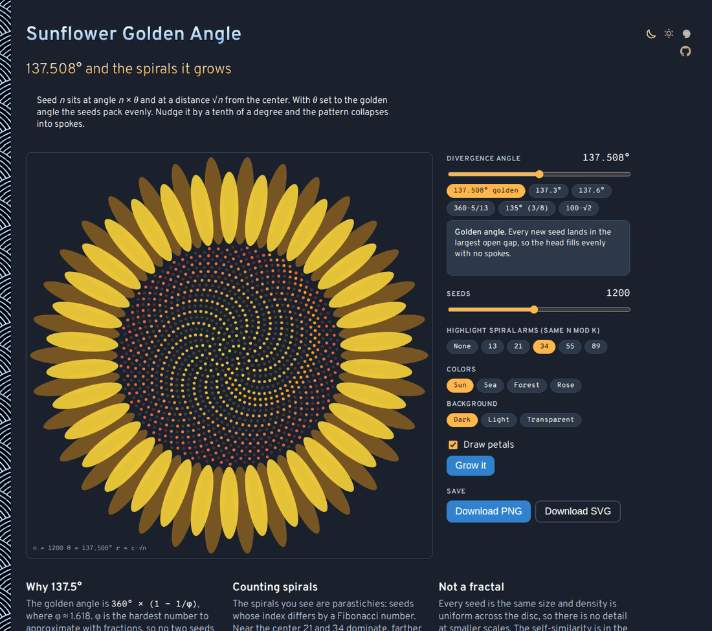

# Sunflower-Golden-Angle

Grow a sunflower seed head from the golden angle in your browser. Nudge the angle by a tenth of a degree and watch the even packing fall apart into spokes, then highlight the Fibonacci spirals and count them. No sign-up and no libraries.

- [Grow a sunflower](https://evoluteur.github.io/sunflower-golden-angle/)

## What it does

Seed *n* is placed at angle *n* × θ and at a distance √*n* from the center (Vogel's model). With θ set to the golden angle, 360° × (1 − 1/φ) ≈ 137.508°, the seeds fill the disc evenly.

- **Divergence angle**: a slider from 130° to 145°, plus presets. 137.3° and 137.6° bend into curved spokes, 360·5/13 and 135° (3/8 of a turn) collapse into straight spokes, and 100·√2 is irrational but not golden. A note explains what you are seeing for each angle.
- **Seeds**: from 50 to 2,500.
- **Spiral arms**: highlight the seeds whose index has the same remainder mod 13, 21, 34, 55 or 89. Those are the parastichies, the spirals you count on a real sunflower.
- **Grow it**: animates the head filling in from one seed.
- **Petals**: show or hide the ring of petals.

The sunflower is not a fractal: every seed is the same size and there is no finer detail when you zoom in. The self-similarity is in the spiral counts, which climb the Fibonacci sequence as you move outward.

## How it is built

Plain HTML, CSS and JavaScript, with no dependencies and no build step. Just open `index.html`. The seed head is drawn on a canvas.

- The app logic is in [js/sunflower.js](https://github.com/evoluteur/sunflower-golden-angle/blob/main/js/sunflower.js), its styles in `css/sunflower.css`.
- Three color themes (dark, light and blue) are shared with my other projects through [OMG-Themes](https://github.com/evoluteur/omg-themes). Run `npm run sync:themes` to refresh `css/core.css`, `css/densities.css`, `css/themes/*` and `js/omg.js` from it. Project tweaks go in `css/overrides.css`.
- Your theme is kept in the browser's local storage.

Sunflower-Golden-Angle is open source at [GitHub](https://github.com/evoluteur/sunflower-golden-angle) with MIT license.

Had fun browsing the app? [Buy me a coffee by becoming a sponsor](https://github.com/sponsors/evoluteur).

You may also be interested in my other projects [Mandala Maker](https://github.com/evoluteur/mandala-maker), [Cymatics](https://github.com/evoluteur/cymatics) and [Sacred Geometry](https://github.com/evoluteur/sacred-geometry). See them all on [Esoterica](https://evoluteur.github.io/esoterica.html).

Copyright (c) 2026 [Olivier Giulieri](https://evoluteur.github.io/).
